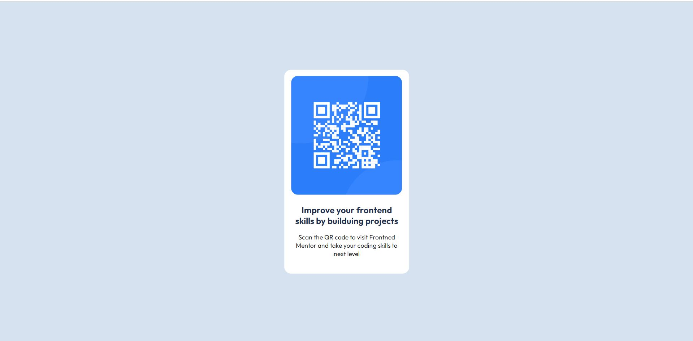

# Frontend Mentor - QR code component solution

This is a solution to the [QR code component challenge on Frontend Mentor](https://www.frontendmentor.io/challenges/qr-code-component-iux_sIO_H). Frontend Mentor challenges help you improve your coding skills by building realistic projects.

## Table of contents

- [Overview](#overview)
  - [Screenshot](#screenshot)
  - [Links](#links)
- [Author](#author)

## Overview
 - This is simple HTML, CSS project to refresh my Skills.

### Screenshot

### Links
- Live Site URL: (https://futureciso.github.io/frontend-mentor-QR/)

## Author
Mr Unik
